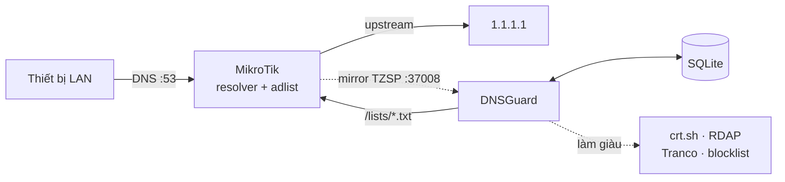
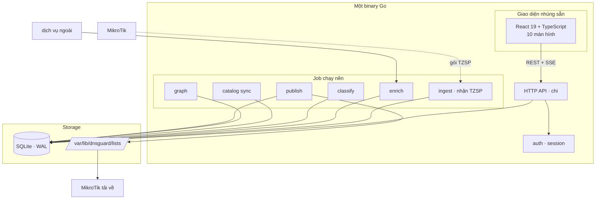
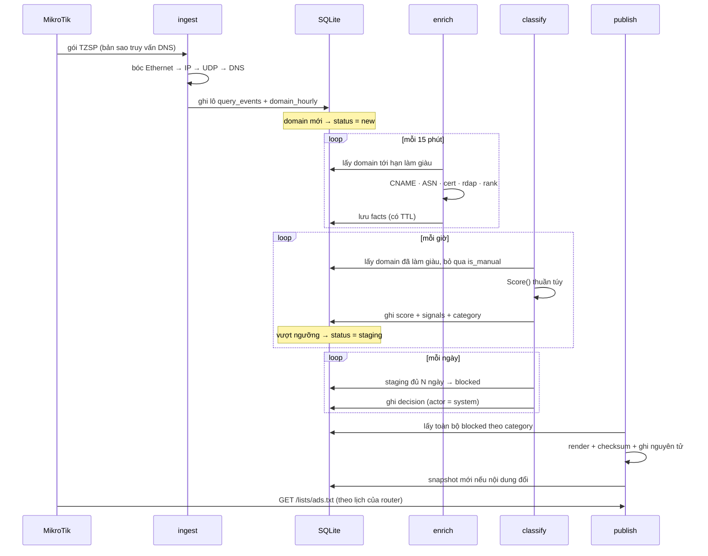

# 02 — Kiến trúc

## 1. Bối cảnh

DNSGuard là một thành phần trong hệ thống lớn hơn, và ranh giới của nó quan trọng
hơn nội dung bên trong.



Hai đường nét đứt là ranh giới trách nhiệm. DNSGuard **nhận** dữ liệu quan sát và
**trả** danh sách quyết định. Nó không chạm vào đường truy vấn DNS. Nếu tiến trình
DNSGuard bị kill, mũi tên `MT → UP` vẫn hoạt động và MikroTik vẫn chặn bằng file đã
tải về lần trước.

## 2. Sơ đồ thành phần

Toàn bộ hệ thống là một tiến trình. Các module bên dưới là package Go, không phải
dịch vụ riêng.



## 3. Module backend

Mỗi module là một package Go dưới `internal/`, có giao diện rõ ràng và test riêng.

### `ingest`

Nhận luồng TZSP và biến thành sự kiện có cấu trúc.

- Lắng nghe UDP trên cổng cấu hình được (mặc định 37008)
- Bóc TZSP → Ethernet (kể cả thẻ VLAN và QinQ) → IPv4/IPv6 → UDP → DNS
- Nhận cả hai chiều, vì `filter-port=53` trên sniffer khớp cả hai:
  - **cổng đích 53, cờ QR bằng 0** — truy vấn client gửi lên router. IP nguồn là
    client thật, nên gói này thành `query_events`.
  - **cổng nguồn 53, cờ QR bằng 1** — câu trả lời. IP nguồn là resolver chứ không
    phải client, nên gói này chỉ đóng góp ánh xạ domain → IP vào `domain_ips`; quy
    kết client lấy từ truy vấn tương ứng đã ghi trước đó.
- Chỉ ghi nhận loại bản ghi `A`, `AAAA`, `HTTPS` — phần còn lại là nhiễu nền của
  mDNS và dịch vụ nội bộ
- Trong phần trả lời chỉ lấy `A` và `AAAA`, và quy mọi địa chỉ về **tên trong phần
  câu hỏi**: khi có chuỗi CNAME, bản ghi địa chỉ mang tên đích của chuỗi, nhưng thứ
  client hỏi — và thứ nằm trong bảng `domains` — là tên ở phần câu hỏi
- Ghi theo lô 1.000 bản ghi hoặc mỗi 2 giây, tùy cái nào đến trước
- Cập nhật bảng tổng hợp `domain_hourly` trong cùng transaction

**Bóc tên trong phần trả lời không đi theo con trỏ nén.** Phần câu hỏi không dùng nén
nên đọc thẳng; phần trả lời dùng nén rất nhiều, nhưng ở đó chỉ cần biết tên *kết thúc
ở đâu* để đọc các trường phía sau, mà một con trỏ luôn là hai byte cuối của tên trên
dây. Không có bước nhảy nào nghĩa là một gói dị dạng có con trỏ trỏ vòng lại chính nó
cũng không treo được bộ nhận.

**Ba goroutine tách biệt.** Một goroutine chỉ đọc socket và bóc gói; hai goroutine
chỉ gom lô và ghi CSDL — một cho truy vấn, một cho lượt phân giải — mỗi bên nối bằng
một kênh có đệm riêng, để bên chậm không chặn bên kia. Tách ra vì việc ghi đĩa
chậm không được phép làm đầy bộ đệm nhận của nhân: datagram UDP mất là mất hẳn,
không có cách nào lấy lại. Khi hàng đợi đầy, sự kiện bị bỏ và **được đếm lại** —
con số đó hiện trên `/health` chứ không biến mất im lặng.

**Vì sao tự bóc gói thay vì dùng thư viện bắt gói.** Phần cần dùng chỉ là tên miền,
loại bản ghi và IP nguồn. Một thư viện bắt gói đầy đủ kéo theo phụ thuộc native, phá
vỡ việc biên dịch tĩnh, và làm ảnh Docker phải có libc. Bóc tay gọn trong khoảng hai
trăm dòng và có bộ test riêng cho từng lớp giao thức.

### `enrich`

Bổ sung thông tin ngoài cho domain ứng viên.

Mỗi nguồn làm giàu là một `Enricher` với cùng interface:

```go
type Enricher interface {
    Name() string
    Enrich(ctx context.Context, domain string) (any, error)
}
```

Các implementation: `DNSEnricher` (chuỗi CNAME, A/AAAA), `ASNEnricher` (bảng iptoasn
cục bộ), `CertEnricher` (crt.sh), `RDAPEnricher` (tuổi domain), `RankEnricher`
(Tranco), `HTTPEnricher` (header và HTML tĩnh của trang gốc), `VTEnricher`
(VirusTotal).

Hai nguồn cuối khác các nguồn còn lại ở chỗ chúng chạm trực tiếp tới máy chủ đích
hoặc tiêu quota có hạn, nên đi qua một cổng lọc hẹp hơn hẳn ở tầng worker: chỉ domain
đang chờ quyết định, có lưu lượng thật, và không nằm trong danh sách bảo vệ. Chi tiết
ở [06 §2.4](06-classification.md).

`HTTPEnricher` từ chối mọi domain phân giải về địa chỉ nội bộ. Không có bước đó, một
domain độc hại chỉ cần trỏ bản ghi A về địa chỉ router là biến DNSGuard thành công cụ
gọi vào chính mạng đang được bảo vệ.

Nguyên tắc chung, thực thi ở lớp bọc `guarded` chứ không lặp lại trong từng nguồn:

- Kết quả cache trong CSDL với TTL riêng; hết TTL mới tra lại
- Giới hạn tốc độ bằng `golang.org/x/time/rate`, cấu hình riêng từng nguồn
- Circuit breaker: 5 lỗi liên tiếp thì tạm ngưng nguồn đó 15 phút
- Lỗi của một nguồn không làm hỏng kết quả của các nguồn khác

### `classify`

Chấm điểm và gán nhãn. Chi tiết thuật toán ở [06](06-classification.md).

Điểm quan trọng về kiến trúc: module này **thuần túy**, không có I/O.

```go
func Score(d Domain, f Facts, w Weights) Result
```

Nhờ vậy nó test được bằng bảng dữ liệu, chạy lại được trên toàn bộ CSDL khi đổi trọng
số mà không phải tra lại dịch vụ ngoài, và bảng xem trước tác động là **chính xác
tuyệt đối** chứ không phải ước lượng — cùng đầu vào luôn cho cùng đầu ra.

### `graph`

Dựng quan hệ giữa các domain. Bốn loại cạnh:

| Loại | Nguồn dữ liệu | Cách tính |
|---|---|---|
| `cname_to` | enrich | trực tiếp từ chuỗi CNAME, nối theo từng mắt xích |
| `same_asn` | enrich | cùng ASN và ASN đó không nằm trong tập trung tính |
| `same_cert` | crt.sh | xuất hiện cùng một chứng chỉ |
| `co_occurs` | query log | cùng client, cách nhau dưới 3 giây, tính theo PMI chuẩn hóa |

Cạnh `co_occurs` tính lại theo lô mỗi đêm, không tính realtime — nó cần quét toàn bộ
cửa sổ 7 ngày và tốn kém.

**Vì sao PMI chứ không phải đếm thô.** Đếm thô cho điểm cao nhất cho những domain phổ
biến nhất, mà điều đó thì đã biết rồi. PMI trả lời đúng câu hỏi cần hỏi: hai domain
này xuất hiện cùng nhau nhiều hơn mức ngẫu nhiên bao nhiêu lần.

### `catalog`

Đồng bộ blocklist công khai. Mỗi nguồn có URL, lịch, và trạng thái lần đồng bộ cuối.

Phép biến đổi áp dụng theo thứ tự: bỏ chú thích → cắt khoảng trắng → chuyển về ASCII
→ kiểm tra hợp lệ → khử trùng lặp. Khử trùng lặp giữ nguyên thứ tự xuất hiện đầu tiên
để nội dung ổn định giữa các lần đồng bộ.

Bảo vệ: nếu nguồn trả về ít hơn 50% số lượng lần trước, **giữ nguyên dữ liệu cũ** và
ghi cảnh báo. Nguồn ngoài trả về trang lỗi HTML thay vì danh sách là chuyện thường
xuyên, và một lần như thế không được phép xóa sạch danh sách đang dùng.

Gửi `If-None-Match` với ETag đã lưu; nhận 304 thì không tải lại, không ghi lại.

### `publish`

Render danh sách ra file tĩnh trên đĩa.

- Ghi ra file tạm cùng thư mục, `Sync()`, rồi `os.Rename` — thao tác nguyên tử
- Một file cho mỗi phân loại đang bật, cộng một file gộp
- Tính SHA-256, so với snapshot trước; giống nhau thì không ghi và không tạo snapshot
- Chặn xuất bản nếu số lượng giảm quá ngưỡng cấu hình
- Sắp xếp theo tên để nội dung ổn định, nhờ đó checksum chỉ đổi khi tập domain đổi

**Vì sao file tĩnh chứ không sinh động khi có request:** router tải theo lịch và
không giữ kết nối lâu. Sinh động nghĩa là mỗi lần tải phải quét hàng trăm nghìn dòng
từ CSDL, và nếu CSDL chậm thì router timeout giữa chừng. File tĩnh cũng có nghĩa là
danh sách vẫn phục vụ được kể cả khi backend gặp sự cố.

**Vì sao ghi nguyên tử là bắt buộc, không phải tối ưu:** router có thể tải file đúng
lúc đang ghi, và một file dở dang nghĩa là danh sách chặn thiếu một nửa.

### `worker`

Hàng đợi job và bộ lập lịch, chạy trên chính CSDL.

| Job | Chu kỳ | Việc |
|---|---|---|
| `enrich` | 15 phút | làm giàu domain tới hạn |
| `classify` | 1 giờ | chấm điểm lại ứng viên |
| `catalog_sync` | 1 giờ | đồng bộ nguồn tới hạn |
| `publish` | 6 giờ, và ngay sau quyết định thủ công | render danh sách |
| `lifecycle` | 24 giờ | staging → blocked, hết hạn blocked |
| `behavior` | 24 giờ | tính lại đặc trưng hành vi |
| `graph` | 24 giờ | dựng lại các loại cạnh |
| `retention` | 24 giờ | xóa dữ liệu quá hạn |

Job hỏng được thử lại với backoff lũy thừa (1, 2, 4 phút) cho tới khi hết số lần thử.
Bộ lập lịch chỉ xếp hàng khi chưa có job cùng loại đang chờ — không có bước này, một
job chậm hơn chu kỳ của nó sẽ tích tụ vô hạn.

### `llm` · `mcp` · `ai` — *tuỳ chọn*

Ba gói của tính năng hỏi AI, tách theo mức độ biết về nghiệp vụ:

- **`llm`** chỉ biết giao thức Chat Completions kiểu OpenAI. Không biết gì về domain.
  Nhà cung cấp nào nói được giao thức đó đều dùng được — DeepSeek, OpenAI, Ollama.
- **`mcp`** là client Model Context Protocol tối giản: bắt tay, liệt kê công cụ, gọi
  công cụ. JSON-RPC 2.0 trên HTTP.
- **`ai`** là tầng nghiệp vụ: gom domain thành lô để hỏi, đọc phản hồi CSV, chạy vòng
  lặp gọi công cụ cho phần hỏi đáp, và giữ nhật ký ở **một file CSDL riêng**.

`ai.Classifier` cài `enrich.BatchEnricher` nên nó nằm trong registry cùng các nguồn
làm giàu khác và thừa hưởng nguyên giới hạn tốc độ cùng circuit breaker ở đó. Chỉ đúng
một thứ của AI đi vào CSDL chính: dòng `domain_facts(source='ai')`.

Cả cụm là tuỳ chọn: không cấu hình model nào thì nó tự tắt và mọi thứ khác không đổi.
Xem [09](09-ai.md).

### `api`

Lớp HTTP. Mỏng — chỉ xác thực, kiểm tra đầu vào, gọi service, dựng response. Không có
logic nghiệp vụ ở đây. Đây cũng là chỗ duy nhất biết cả lỗi nghiệp vụ lẫn mã HTTP.

## 4. Luồng dữ liệu

### Luồng chính: từ gói tin tới file chặn



### Luồng phụ: quản trị can thiệp

Quyết định thủ công đi thẳng, không qua staging:

```
UI → POST /api/v1/domains/:id/decision
     → ghi decisions kèm ảnh chụp trạng thái
     → cập nhật status, đặt is_manual = true
     → xếp hàng job publish, chạy trong vài giây
```

Cờ `is_manual` khiến các lần `classify` sau bỏ qua domain đó. Đây là bất biến quan
trọng nhất của hệ thống: **con người thắng máy, và không bị ghi đè**. Nó được thực
thi ở ba chỗ độc lập — mệnh đề `WHERE is_manual = 0` trong truy vấn lấy ứng viên,
kiểm tra lại bên trong transaction ghi điểm, và mệnh đề tương tự trong câu lệnh
chuyển trạng thái.

## 5. Quyết định kỹ thuật

Mỗi quyết định ghi theo dạng ngắn: bối cảnh, lựa chọn, đánh đổi.

### ADR-1 Go cho toàn bộ backend

*Bối cảnh:* chạy trên phần cứng nhỏ, xử lý vài triệu dòng log, phục vụ API, và bóc
gói tin ở tốc độ vài nghìn gói mỗi giây.

*Chọn:* Go 1.26, một binary tĩnh.

*Vì sao:* biên dịch thành một file, không runtime, không quản lý phiên bản ngôn ngữ
trên máy đích. Bộ nhớ dự đoán được. Goroutine hợp với mô hình nhiều worker độc lập,
và mô hình đó cũng chính là thứ cho phép tách vòng đọc socket khỏi vòng ghi CSDL.

*Đánh đổi:* viết dài dòng hơn; ít thư viện phân tích dữ liệu sẵn có. Chấp nhận được
vì phần phân tích ở đây là quy tắc chứ không phải học máy.

### ADR-2 SQLite, không phải PostgreSQL

*Bối cảnh:* cần lưu vài trăm nghìn domain, vài triệu sự kiện, và một đồ thị quan hệ,
trên một máy phục vụ đúng một mạng.

*Chọn:* SQLite ở chế độ WAL, với driver Go thuần (`modernc.org/sqlite`).

*Vì sao:* toàn bộ hệ thống thu về **một binary và một file**. Không có service thứ
hai phải khởi động đúng thứ tự, không có chuỗi kết nối để cấu hình sai, không có
phiên bản máy chủ CSDL để nâng cấp. Driver Go thuần giữ được `CGO_ENABLED=0`, nên
binary vẫn tĩnh và ảnh Docker vẫn dựng được cho nhiều kiến trúc mà không cần
cross-compile toolchain. Sao lưu là chép một file.

*Đánh đổi:* SQLite cho phép nhiều đầu đọc nhưng chỉ một đầu ghi. Xử lý bằng cách tách
hai pool kết nối — pool ghi giới hạn đúng một kết nối, pool đọc nhiều kết nối. Việc
này biến "database is locked" từ lỗi lúc chạy thành hàng đợi trong tiến trình. Mất
truy vấn đồ thị đệ quy và tìm kiếm mờ của PostgreSQL: bù lại bằng cột `name_rev`
(tìm hậu tố thành tìm tiền tố, dùng được index) và một hàm `REGEXP` đăng ký thêm.

### ADR-3 SQL viết tay, không ORM và không sinh code

*Bối cảnh:* nhiều truy vấn phức tạp, cần hiệu năng dự đoán được.

*Chọn:* SQL viết tay trong package `store`, tham số hóa toàn bộ.

*Vì sao:* truy vấn đồ thị và tổng hợp thời gian không diễn đạt gọn bằng ORM. Bỏ luôn
bước sinh code vì nó thêm một công cụ nữa vào cả môi trường phát triển lẫn ảnh Docker,
đổi lấy thứ mà một package `store` có kiểu rõ ràng đã cho sẵn.

*Đánh đổi:* không có kiểm tra kiểu lúc biên dịch giữa câu lệnh SQL và struct Go. Bù
lại bằng test tích hợp chạy trên CSDL thật cho mọi truy vấn.

**Quy tắc không có ngoại lệ: mọi truy vấn phải có `LIMIT`.** Một truy vấn không giới
hạn trên bảng domain sẽ kéo về nửa triệu dòng và giết tiến trình.

### ADR-4 Hàng đợi job chạy trên chính CSDL

*Bối cảnh:* nhiều job định kỳ và job kích hoạt theo sự kiện, cần thử lại và theo dõi.

*Chọn:* bảng `jobs` trong cùng file SQLite, worker trong cùng tiến trình.

*Vì sao:* không phải chạy thêm Redis hay một dịch vụ hàng đợi. Job và dữ liệu nghiệp
vụ cùng một file, nên không bao giờ có trạng thái mồ côi khi một bên chết. Pool ghi
chỉ có một kết nối nên việc nhận job tự nó đã tuần tự hóa — không cần khóa phân tán.

*Đánh đổi:* thông lượng thấp hơn hàng đợi chuyên dụng. Không thành vấn đề — job ở đây
tính bằng nghìn mỗi ngày, không phải nghìn mỗi giây.

### ADR-5 Nhận TZSP trực tiếp, không qua file trung gian

*Bối cảnh:* cần lấy được truy vấn DNS kèm IP client thật.

*Chọn:* bộ nhận TZSP nằm trong chính tiến trình DNSGuard.

*Vì sao:* một quá trình, một ngôn ngữ, một thứ để cài và giám sát. Không có file
trung gian nghĩa là không có con trỏ đọc phải quản lý, không có chuyện file xoay vòng
làm mất dữ liệu, và không có độ trễ giữa lúc bắt gói và lúc phân tích.

*Đánh đổi:* mất bộ đệm tự nhiên mà file trên đĩa mang lại — nếu DNSGuard dừng, những
gói mirror trong lúc đó mất hẳn. Chấp nhận được vì dữ liệu ở đây là quan sát thống
kê: mất vài phút không ảnh hưởng tới quyết định đã ghi, và bảng `decisions` — thứ
thực sự không thay thế được — không phụ thuộc vào nó.

### ADR-6 Không dùng học máy ở giai đoạn đầu

*Bối cảnh:* phân loại domain là bài toán phân lớp, dễ nghĩ tới gradient boosting.

*Chọn:* quy tắc có trọng số, có thể giải thích được.

*Vì sao:* người dùng phải hiểu vì sao một domain bị chặn — đó là yêu cầu FR-3.2, và
là lý do tồn tại của cả sản phẩm. Một mô hình cho ra 0.87 mà không nói được vì sao
thì vô dụng ở đây. Ngoài ra dữ liệu huấn luyện của một mạng đơn lẻ quá ít.

*Đánh đổi:* trần độ chính xác thấp hơn. Chấp nhận; có thể thêm tầng ML sau, dùng
điểm quy tắc làm đặc trưng đầu vào chứ không thay thế nó.

### ADR-7 React + TypeScript, nhúng vào binary

*Bối cảnh:* giao diện có bảng lớn, đồ thị tương tác, thao tác bàn phím.

*Chọn:* React 19 + TypeScript + Vite, kết quả biên dịch nhúng bằng `go:embed`.

*Vì sao:* bảng nửa triệu dòng cần ảo hóa; đồ thị quan hệ cần state phía client; hàng
đợi duyệt cần cập nhật lạc quan để phản hồi tức thì khi bấm phím. Nhúng vào binary
để không có bước triển khai riêng cho frontend và không có khả năng giao diện lệch
phiên bản so với API.

*Đánh đổi:* bundle lớn hơn giao diện dựng phía máy chủ, và mỗi lần sửa giao diện phải
biên dịch lại binary. Chấp nhận vì chạy trong LAN, và vì phần lớn thay đổi đi kèm
thay đổi API.

## 6. Cây thư mục

```
dnsguard/
├── cmd/
│   ├── dnsguard/          binary chính: API + worker + bộ nhận TZSP
│   └── dnsguard-cli/      tiện ích: migrate, quản lý tài khoản, xuất bản, sao lưu
├── internal/
│   ├── config/            đọc cấu hình từ biến môi trường
│   ├── store/             toàn bộ truy cập CSDL
│   │   └── migrations/    *.sql nhúng vào binary
│   ├── ingest/            bộ nhận TZSP và bộ bóc gói
│   ├── enrich/            dns · asn · cert · rdap · rank · http · vt · ai
│   ├── classify/          thuần túy, không I/O
│   ├── graph/             bốn loại cạnh quan hệ
│   ├── catalog/           đồng bộ blocklist công khai
│   ├── publish/           render danh sách, ghi nguyên tử
│   ├── auth/              argon2id, phiên, CSRF
│   ├── events/            bus sự kiện cho SSE
│   ├── llm/               giao thức Chat Completions, không biết nghiệp vụ
│   ├── mcp/               client Model Context Protocol
│   ├── ai/                hỏi model theo lô, hỏi đáp, công cụ, skill
│   │   └── migrations/    lược đồ của CSDL nhật ký AI (file riêng)
│   ├── worker/            hàng đợi job và bộ lập lịch
│   ├── api/               HTTP handler và middleware
│   └── web/               nhúng giao diện đã biên dịch
├── web/                   mã nguồn frontend, xem 05
├── deploy/
│   ├── Dockerfile
│   ├── docker-compose.yml
│   └── systemd/
├── docs/
└── Makefile
```

## 7. Cấu hình

Mọi giá trị đặt được qua biến môi trường, tiền tố `DNSGUARD_`.

| Biến | Mặc định | Ý nghĩa |
|---|---|---|
| `DNSGUARD_DB_PATH` | `/var/lib/dnsguard/dnsguard.db` | File CSDL |
| `DNSGUARD_LISTEN` | `:8080` | Địa chỉ HTTP |
| `DNSGUARD_TZSP_LISTEN` | `:37008` | Cổng UDP nhận luồng mirror |
| `DNSGUARD_LISTS_DIR` | `/var/lib/dnsguard/lists` | Nơi ghi file xuất bản |
| `DNSGUARD_IP2ASN_PATH` | `/var/lib/dnsguard/ip2asn.tsv.gz` | Bảng tra ASN |
| `DNSGUARD_TRANCO_PATH` | — | Danh sách Tranco (CSV hoặc ZIP) |
| `DNSGUARD_LOG_RETENTION_DAYS` | `90` | Xóa sự kiện thô sau bao lâu |
| `DNSGUARD_HOURLY_RETENTION_DAYS` | `400` | Giữ bảng tổng hợp theo giờ |
| `DNSGUARD_STAGING_DAYS` | `7` | Thời gian canary trước khi tự chặn |
| `DNSGUARD_CONFIRM_TTL_DAYS` | `180` | Domain đã chặn im lặng bao lâu thì hết hạn |
| `DNSGUARD_ENRICH_CONCURRENCY` | `4` | Số job làm giàu song song |
| `DNSGUARD_EXTERNAL_ENABLED` | `true` | Tắt toàn bộ truy vấn ra ngoài |
| `DNSGUARD_HTTP_ANALYSIS_ENABLED` | `false` | Tải trang gốc của domain để phân tích header và HTML |
| `DNSGUARD_VT_API_KEY` | — | Khóa API VirusTotal; đặt được trên giao diện và giá trị đó thắng |
| `DNSGUARD_PUBLISH_MIN_RATIO` | `0.5` | Ngưỡng chặn xuất bản khi sụt giảm |
| `DNSGUARD_PUBLISH_SINK` | `0.0.0.0` | Địa chỉ mặc định trong file hosts; đổi được trên giao diện |
| `DNSGUARD_RESOURCE_SAMPLE_SECONDS` | `10` | Nhịp đo RAM và CPU của chính dịch vụ |
| `DNSGUARD_RESOURCE_RETAIN_DAYS` | `30` | Giữ mẫu đo tài nguyên bao lâu |
| `DNSGUARD_LISTS_ALLOW_CIDR` | — | Dải IP được tải `/lists/*`; trống là tất cả |
| `DNSGUARD_SESSION_TTL_HOURS` | `168` | Thời hạn phiên đăng nhập |
| `DNSGUARD_AUTO_MIGRATE` | `true` | Chạy migration khi khởi động |
| `DNSGUARD_ADMIN_PASSWORD` | — | Mật khẩu admin đầu tiên; trống thì tự sinh |
| `DNSGUARD_METRICS_TOKEN` | — | Bảo vệ `/metrics` bằng bearer token |
| `DNSGUARD_LOG_LEVEL` | `info` | `debug` · `info` · `warn` · `error` |

Ba khóa trong bảng này đặt được cả ở biến môi trường lẫn trên giao diện:
`HTTP_ANALYSIS_ENABLED`, `VT_API_KEY` và `PUBLISH_SINK`. Giá trị lưu trên giao diện
thắng, vì nó mới hơn và là hành động có chủ ý, trong khi biến môi trường thường nằm
trong file compose từ lần cài đặt đầu. Ngoại lệ là `EXTERNAL_ENABLED`: đó là công tắc
cứng, tắt ở đó thì bật trên giao diện cũng không có tác dụng.

## 8. Bảo mật

| Mặt | Cách xử lý |
|---|---|
| Xác thực | Phiên lưu server-side, cookie `HttpOnly` `SameSite=Lax`, hết hạn 7 ngày |
| Mật khẩu | argon2id, tham số theo khuyến nghị OWASP, nhúng trong chuỗi băm |
| Token phiên | CSDL chỉ lưu băm SHA-256; rò rỉ CSDL không cho phép mạo danh phiên |
| Phân quyền | Middleware kiểm tra vai trò ở mức route |
| CSRF | Token riêng cho mọi phương thức thay đổi trạng thái, so sánh thời gian hằng định |
| Chống dò mật khẩu | 5 lần sai / IP / 15 phút, và độ trễ phản hồi cố định 500 ms |
| Đầu vào | Validate tên miền theo RFC trước khi lưu; từ chối ký tự lạ |
| SQL | Toàn bộ câu lệnh tham số hóa, không nối chuỗi |
| Nhật ký quyết định | Trigger CSDL chặn UPDATE và DELETE, kể cả khi ứng dụng có bug |
| Endpoint danh sách | Chỉ đọc, không cần xác thực, giới hạn theo dải IP nguồn |
| Dữ liệu ra ngoài | Chỉ tên miền gửi tới crt.sh và RDAP; không bao giờ gửi IP client |
| Đường dẫn file | `/lists/{file}` chỉ nhận tên file `.txt`, từ chối mọi thành phần thư mục |
