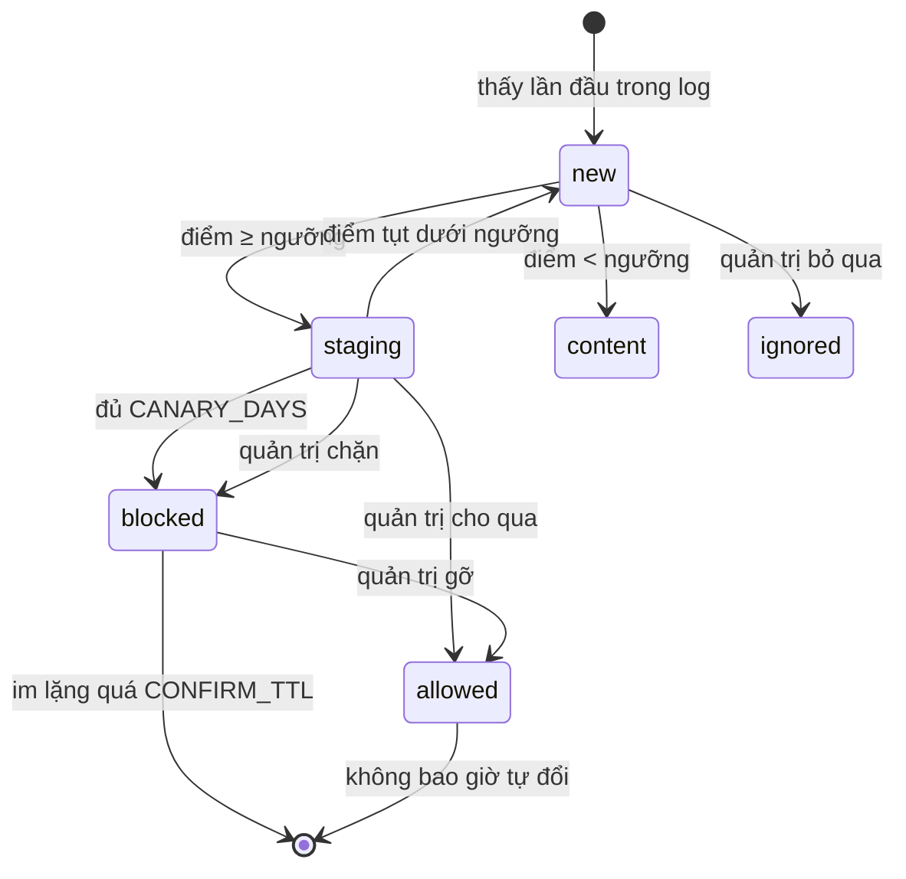

# 06 — Bộ phân loại

Module này quyết định domain nào bị chặn. Nó phải **giải thích được** — mọi kết luận
đều truy ngược về các tín hiệu cụ thể với trọng số nhìn thấy được. Đây không phải yêu
cầu về tính minh bạch cho vui; nó là lý do tồn tại của sản phẩm.

## 1. Taxonomy

Tám phân loại, thiết kế theo nguyên tắc: mỗi loại tương ứng với một quyết định vận
hành khác nhau. Nếu hai loại luôn được xử lý giống hệt nhau thì chúng nên là một.

| `key` | Tiếng Việt | Nội dung | Mặc định |
|---|---|---|---|
| `ads` | Quảng cáo | Máy chủ phục vụ banner, video ad, ad exchange, RTB | chặn |
| `tracking` | Theo dõi | Analytics, pixel, đo lường hành vi người dùng | chặn |
| `telemetry` | Telemetry | Báo cáo trạng thái thiết bị và ứng dụng về nhà sản xuất | chặn |
| `malware` | Độc hại | Phishing, C2, phát tán mã độc | chặn |
| `cryptomining` | Đào tiền mã hóa | Script đào trên trình duyệt | chặn |
| `adult` | Nội dung người lớn | | tắt |
| `cdn` | CDN dùng chung | Hạ tầng phục vụ cả nội dung lẫn quảng cáo | **không bao giờ chặn** |
| `content` | Nội dung | Domain first-party bình thường | không chặn |

Hai loại cuối tồn tại để **ngăn chặn nhầm**, không phải để chặn. Gán nhãn `cdn` cho
một domain nghĩa là ghi lại kết luận "đã xem xét, không được chặn cái này" — có giá
trị hơn nhiều so với việc để nó không phân loại và bị xem xét lại mỗi tuần.

`adult` mặc định tắt vì đó là quyết định chính sách của từng gia đình, không phải mặc
định kỹ thuật.

## 2. Tín hiệu

Mỗi tín hiệu là một hàm thuần túy trên `(Domain, Facts)` trả về có kích hoạt hay
không, kèm chi tiết.

### 2.1 Hạ tầng — mạnh nhất

| `kind` | Trọng số | Điều kiện |
|---|---|---|
| `cname_adtech` | +6,0 | Chuỗi CNAME kết thúc ở tên miền trong tập adtech đã biết |
| `cname_blocked` | +5,0 | Chuỗi CNAME kết thúc ở eTLD+1 có trong blocklist công khai |
| `asn_adtech` | +4,0 | IP đích thuộc ASN trong tập adtech, và ASN đó không trung tính |
| `cert_adtech` | +3,0 | Chứng chỉ chứa SAN thuộc hạ tầng adtech đã biết |

**Vì sao CNAME đứng đầu.** CNAME cloaking là kỹ thuật né blocklist phổ biến nhất hiện
nay: nhà quảng cáo cho khách hàng trỏ một subdomain trông như của chính họ —
`metrics.trangweb.vn` — nhưng bản ghi CNAME dẫn về `eulerian.net`. Blocklist tĩnh
không bắt được vì tên miền nhìn vô hại. Chỉ phân giải động mới thấy đích thật. Một
domain có CNAME trỏ vào hạ tầng adtech gần như chắc chắn phục vụ adtech.

**Vì sao ASN cần lọc trung tính.** ASN của Google (15169) chứa cả `doubleclick` lẫn
`google.com`. Cloudflare (13335) chứa gần như mọi thứ. Đưa những ASN này vào tập
adtech sẽ chặn nửa Internet. Tập trung tính phải được duy trì cẩn thận:

```
15169 Google · 13335 Cloudflare · 16509 Amazon · 8075 Microsoft
32934 Meta · 714 Apple · 54113 Fastly · 20940 Akamai
```

### 2.2 Từ vựng

| `kind` | Trọng số | Điều kiện |
|---|---|---|
| `keyword` | +3,0 | Tên chứa từ khóa trong danh sách |
| `random_sub` | +2,0 | Nhãn trái nhất dài ≥ 12 ký tự và entropy Shannon ≥ 3,4 |

Ngưỡng entropy 3,4 chọn từ đo đạc thực tế:

| Nhãn | Entropy | Độ dài |
|---|---|---|
| `a7f3k9x2m1qz` | 3,58 | 12 |
| `tracking` | 3,00 | 8 |
| `cdn` | 1,58 | 3 |
| `www` | 0,00 | 3 |

Yêu cầu đồng thời cả độ dài và entropy: `cdn` có entropy thấp, còn một nhãn ngắn ngẫu
nhiên như `x7q` tuy entropy cao nhưng không đủ bằng chứng.

Danh sách từ khóa mặc định:

```
adserv adservice adsystem adnxs doubleclick adtech advert banner
popads pubads adroll adcolony analytic telemetry metric tracking
tracker beacon pixel collect clickserv impression rtb bidder
prebid dsp ssp cdn-ads affiliate retarget
```

Chỉ tính một lần dù khớp nhiều từ — nếu không, một domain như
`ads-tracking-analytics.com` sẽ được cộng ba lần cho cùng một bằng chứng.

### 2.3 Hành vi — cần IP client thật

| `kind` | Trọng số | Điều kiện |
|---|---|---|
| `third_party` | +2,5 | Trên 80% lần xuất hiện là trong vòng 3 giây sau một domain khác gốc |
| `third_party_weak` | +1,0 | Tỉ lệ trên trong khoảng 50–80% |
| `fan_out` | +1,5 | Từ 5 client trở lên, và tỉ lệ third-party trên 60% |
| `beacon` | +2,0 | Hệ số biến thiên khoảng cách truy vấn < 0,35 với ≥ 50 truy vấn |

Trực giác: người dùng chủ động gõ tên miền nội dung vào trình duyệt. Không ai gõ tên
một máy chủ quảng cáo. Nên domain quảng cáo luôn xuất hiện *sau* một domain khác, và
xuất hiện trên nhiều máy đang xem những thứ chẳng liên quan gì tới nhau.

`beacon` bắt telemetry: con người tạo ra khoảng cách truy vấn không đều, phần mềm báo
cáo định kỳ thì đều một cách máy móc.

**Cảnh báo về kiến trúc.** Nhóm tín hiệu này chỉ dùng được khi query log giữ được IP
của từng client. Nếu nguồn log đến từ một resolver mà router forward vào, mọi truy vấn
sẽ mang cùng một IP và cả ba tín hiệu trở nên vô nghĩa. Bộ thu thập hiện tại dùng
mirror gói tin nên giữ được IP thật — xem [02 §5, ADR-5](02-architecture.md).

### 2.4 Phân tích HTTP — header và HTML tĩnh

Tải trang gốc của domain và đọc header phản hồi cùng HTML **tĩnh**. Không chạy
JavaScript, không tải tài nguyên con, không đi quá trang gốc.

| `kind` | Trọng số | Điều kiện |
|---|---|---|
| `http_beacon` | +4,0 | Trả 204, hoặc ảnh một điểm ảnh, hoặc 200 thân rỗng không phải HTML |
| `http_redirect_adtech` | +4,0 | Chuyển hướng tới host thuộc hạ tầng adtech đã biết |
| `http_parking` | +3,0 | HTML khớp dấu vân tay nhà cung cấp trang đỗ tên miền |
| `http_p3p` | +2,5 | Có header `P3P` |
| `http_tracking_cookie` | +2,0 | `Set-Cookie` có `SameSite=None; Secure` và sống ≥ 90 ngày |
| `http_cors_wildcard` | +1,0 | `Access-Control-Allow-Origin: *` và không phải HTML |
| `http_empty_page` | +1,0 | 200 HTML nhưng dưới 200 ký tự và không có tiêu đề |
| `http_real_site` | **−2,0** | 200 HTML, có tiêu đề, và từ 1500 ký tự trở lên |

**Phân biệt quan trọng nhất của cả nhóm:** tín hiệu ở đây phải nói về *danh tính của
domain*, không phải về *cách trang kiếm tiền*. Một tờ báo nhúng đầy mã quảng cáo vẫn
là nội dung. Vì thế nhóm này **cố ý không** đếm số script bên thứ ba và không dò dấu
vân tay `gtag(` / `fbq(` / `adsbygoogle` — chúng dính vào gần như mọi trang có quảng
cáo, và dùng chúng là cách nhanh nhất phá vỡ mục tiêu precision.

**Vì sao `http_beacon` mạnh.** Một hostname mà trình duyệt đã phân giải nhưng không
trả về trang nào — chỉ một pixel, một 204, hoặc thân rỗng — thì không phải nơi người
ta ghé thăm. Nó là điểm thu thập.

**Vì sao `http_p3p` phân biệt tốt.** P3P là chuẩn đã chết. Ngày nay gần như chỉ còn
các mạng quảng cáo giữ lại để lách chính sách cookie của trình duyệt cũ.

**Không tín hiệu HTTP nào một mình vượt ngưỡng `ads` (5,5).** Đây là ràng buộc thiết
kế có test riêng khóa lại: phân tích HTTP là bằng chứng bổ trợ cho tín hiệu hạ tầng,
không thay thế. Một tín hiệu tự nó đủ để chặn nghĩa là một lần đoán sai đủ để chặn nhầm.

**An toàn.** Trước khi tải, domain được phân giải và **từ chối nếu địa chỉ nằm trong
dải nội bộ** (riêng tư, loopback, link-local, CGNAT, IPv4 bọc trong IPv6). Không có
bước này, một domain độc hại chỉ cần trỏ bản ghi A về `192.168.88.1` là biến DNSGuard
thành công cụ gọi vào trang quản trị của chính router trong mạng.

### 2.5 VirusTotal — xác thực thêm

| `kind` | Trọng số | Điều kiện |
|---|---|---|
| `vt_malicious` | +4,0 | Từ 3 engine trở lên báo độc hại |
| `vt_clean` | −1,0 | Không engine nào báo độc hại và từ 60 engine đã chấm |

Ngưỡng **ba engine** chứ không phải một: một engine đơn lẻ báo động là nhiễu nổi
tiếng của VirusTotal.

+4,0 vượt ngưỡng `malware` (3,0), nghĩa là VirusTotal một mình đủ để đưa domain vào
hàng chờ với nhãn malware. Đó là chủ ý — ngưỡng malware được đặt thấp chính vì loại
bằng chứng này.

**Chỉ tra cho domain đã đạt điểm ≥ 3,0** từ các tín hiệu khác. Bậc miễn phí khoảng
500 lượt mỗi ngày, không đủ để tra mọi domain, và phần lớn domain cũng không cần.

### 2.6 Cấu trúc

| `kind` | Trọng số | Điều kiện |
|---|---|---|
| `spread_high` | +2,5 | Từ 50 subdomain phân biệt trở lên dưới cùng eTLD+1 |
| `spread_mid` | +1,2 | Từ 15 đến 49 subdomain |
| `etld1_blocked` | +4,0 | eTLD+1 đã có trong blocklist công khai |

`spread` không cần IP client nên vẫn hoạt động ở mọi kiến trúc. Máy chủ quảng cáo sinh
subdomain theo chiến dịch, theo khách hàng, theo phiên — hàng trăm cái dưới một gốc.
Trang nội dung hiếm khi vượt vài chục.

### 2.5 Tín hiệu âm

Cộng điểm âm, tồn tại để kéo domain vô hại ra khỏi vùng nguy hiểm.

| `kind` | Trọng số | Điều kiện |
|---|---|---|
| `high_rank` | −8,0 | eTLD+1 nằm trong top 50.000 Tranco |
| `long_lived_content` | −2,0 | Tuổi trên 5 năm và không có tín hiệu hạ tầng nào |
| `shared_cdn` | −6,0 | Phân giải về hạ tầng CDN dùng chung đã biết |

`high_rank` có trọng số lớn hơn mọi tín hiệu dương đơn lẻ. Đó là chủ ý: nếu một domain
trong top 50k Tranco bị chấm điểm cao, khả năng lớn nhất là quy tắc sai chứ không phải
domain đó là quảng cáo. Vẫn có ngoại lệ — `doubleclick.net` xếp hạng rất cao — nên nó
là điểm âm chứ không phải chặn tuyệt đối, và có thể bị các tín hiệu hạ tầng cộng dồn
vượt qua.

## 3. Chấm điểm

```go
// Thuần túy: không I/O, không truy cập CSDL, không thời gian hệ thống.
func Score(d Domain, f Facts, w Weights) Result {
    var signals []Signal

    signals = append(signals, infraSignals(d, f, w)...)
    signals = append(signals, lexicalSignals(d, w)...)
    signals = append(signals, behaviorSignals(d, f, w)...)
    signals = append(signals, structureSignals(d, f, w)...)
    signals = append(signals, negativeSignals(d, f, w)...)

    var score float64
    for _, s := range signals {
        score += s.Weight
    }

    return Result{
        Score:      score,
        Signals:    signals,
        Category:   categorize(d, f, signals),
        Confidence: confidence(signals),
    }
}
```

Tính chất thuần túy là ràng buộc thiết kế, không phải phong cách. Nó cho phép:

- Test bằng bảng dữ liệu, không cần mock
- Chạy lại toàn bộ CSDL khi đổi trọng số mà không tra lại dịch vụ ngoài
- Tính trước tác động (`dry_run`) chính xác tuyệt đối, vì cùng hàm cho ra cùng kết quả

**Không chuẩn hóa điểm về [0,1].** Thang điểm thô dễ suy luận hơn: người vận hành nhìn
`7,5` và thấy ngay đó là `6,0 + 1,5`. Một giá trị `0,83` không nói lên điều gì.

### Độ tin cậy

```go
func confidence(signals []Signal) float64 {
    infra := countKind(signals, kindInfra)     // cname, asn, cert
    total := len(signals)
    switch {
    case infra >= 2:            return 0.95
    case infra == 1 && total >= 3: return 0.85
    case infra == 1:            return 0.70
    case total >= 4:            return 0.60
    default:                    return 0.40
    }
}
```

Độ tin cậy tách khỏi điểm số vì chúng trả lời hai câu hỏi khác nhau. Điểm nói "khả
năng là quảng cáo cao đến đâu"; độ tin cậy nói "bằng chứng chắc đến đâu". Một domain
đạt 6,0 từ hai tín hiệu hạ tầng đáng tin hơn nhiều so với một domain đạt 6,0 từ bốn
tín hiệu hành vi yếu.

UI dùng độ tin cậy để sắp thứ tự trong Triage: bằng chứng chắc lên trước, vì đó là
những cái duyệt nhanh nhất.

### Gán nhãn phân loại

Chạy theo thứ tự, dừng ở cái khớp đầu tiên:

```
1. shared_cdn hoặc high_rank có mặt      → cdn
2. có trong list phân loại malware       → malware
3. có trong list phân loại cryptomining  → cryptomining
4. có trong list phân loại adult         → adult
5. beacon là tín hiệu mạnh nhất          → telemetry
6. keyword khớp nhóm analytics/tracking  → tracking
7. bất kỳ tín hiệu adtech nào            → ads
8. mặc định                              → content
```

Thứ tự quan trọng: quy tắc bảo vệ chạy trước, quy tắc chặn chạy sau.

## 4. Vòng đời



### Vì sao có giai đoạn staging

Domain mới vượt ngưỡng không bị chặn ngay. Nó nằm ở `staging` trong `CANARY_DAYS`
(mặc định 7) để người vận hành có cơ hội can thiệp, và để hệ thống tích lũy thêm dữ
liệu hành vi trước khi ra quyết định.

Chi phí là độ trễ 7 ngày với domain thật sự xấu. Lợi ích là không bao giờ chặn nhầm
một cách âm thầm. Với ad blocking, đánh đổi này đúng chiều: bỏ lọt vài quảng cáo trong
một tuần không sao, chặn nhầm cổng thanh toán thì mất niềm tin vào cả hệ thống.

### Vì sao domain đã chặn không tự hết hạn sớm

Đây là chỗ dễ sai nhất trong toàn bộ vòng đời.

Ở kiến trúc mà thiết bị chặn nằm trước bộ thu thập, domain bị chặn sẽ không còn xuất
hiện trong log. Nếu hệ thống hiểu "không thấy" là "đã chết" và gỡ khỏi danh sách,
domain sẽ hết bị chặn, xuất hiện trở lại, vào staging lại, rồi bị chặn lại — dao động
vĩnh viễn, và mỗi chu kỳ có một khoảng thời gian quảng cáo lọt qua.

Giải pháp: domain ở `blocked` chỉ hết hạn sau `CONFIRM_TTL_DAYS` (mặc định 180) không
xuất hiện. Bất đối xứng với `staging` là chủ ý — ở staging, biến mất nghĩa là domain
ngừng hoạt động; ở blocked, biến mất là bằng chứng hệ thống đang làm đúng việc.

Kiến trúc mirror hiện tại vẫn thấy được truy vấn bị chặn nên không gặp vấn đề này,
nhưng quy tắc giữ nguyên để hệ thống đúng ở cả hai kiến trúc.

### Bất biến

Bốn điều luôn đúng, thực thi ở tầng CSDL và tầng ứng dụng:

1. **`is_manual = true` khiến job chấm điểm bỏ qua domain.** Con người thắng máy.
2. **`allowed` không bao giờ tự chuyển sang trạng thái khác.**
3. **Mọi chuyển trạng thái sinh đúng một dòng `decisions`.**
4. **Domain trong danh sách bảo vệ cứng không bao giờ vào `blocked`,** kể cả khi quản trị yêu cầu — API trả 403.

## 5. Danh sách bảo vệ cứng

Nằm trong code, không sửa được qua UI. Sửa phải qua pull request và review.

```go
var hardAllow = []string{
    // Push notification — chặn là hỏng thông báo toàn bộ thiết bị
    "push.apple.com", "fcm.googleapis.com", "android.clients.google.com",

    // Cập nhật hệ điều hành
    "windowsupdate.com", "swcdn.apple.com",

    // CDN dùng chung — chặn là hỏng hàng loạt trang không liên quan
    "akamai.net", "akamaiedge.net", "cloudfront.net", "fastly.net",
    "gstatic.com", "googleapis.com",

    // Thanh toán Việt Nam
    "vnpay.vn", "vnpayment.vn", "momo.vn", "zalopay.vn",
    "napas.com.vn", "onepay.vn", "payoo.vn",

    // Hạ tầng
    "pool.ntp.org", "ntp.org",
}
```

Khớp theo hậu tố: `vnpay.vn` bảo vệ luôn `api.vnpay.vn`.

Danh sách mềm do người dùng quản lý nằm trong `settings`, sửa được qua UI, và tuân
theo cùng quy tắc khớp hậu tố.

## 6. Đánh giá chất lượng

### Chỉ số

**Precision quan trọng hơn recall.** Chặn nhầm một CDN thanh toán gây thiệt hại lớn
hơn nhiều so với bỏ lọt vài quảng cáo. Mục tiêu: precision ≥ 0,99 trên tập đánh giá,
chấp nhận recall thấp.

Tập đánh giá xây bằng cách lấy mẫu phân tầng theo khoảng điểm rồi gán nhãn tay:

| Khoảng điểm | Số mẫu | Mục đích |
|---|---|---|
| ≥ 8,0 | 50 | Kiểm tra không có false positive ở vùng chắc chắn |
| 5,5 – 8,0 | 100 | Vùng quyết định, quan trọng nhất |
| 3,0 – 5,5 | 100 | Kiểm tra false negative |
| < 3,0 | 50 | Xác nhận vùng an toàn |

Chạy lại đánh giá sau mỗi lần đổi trọng số hoặc thêm tín hiệu mới. Lưu kết quả vào
repo để theo dõi xu hướng.

### Tín hiệu cảnh báo trong vận hành

Những dấu hiệu cho thấy bộ phân loại đang trôi:

| Dấu hiệu | Nghĩa là |
|---|---|
| Số domain vào staging tăng đột biến | Quy tắc quá lỏng, hoặc một nguồn list mới gây nhiễu |
| Nhiều domain bị gỡ chặn thủ công | Precision đang giảm, cần siết ngưỡng |
| Không có domain mới vào staging trong 2 tuần | Nguồn log có thể đã dừng — kiểm tra `/health` |
| Tỉ lệ chặn tụt đột ngột | Nguồn list ngoài hỏng, hoặc xuất bản bị chặn |

Dashboard hiển thị bốn chỉ số này.

## 7. Không dùng học máy ở giai đoạn này

Lý do đầy đủ ở [02 §5, ADR-6](02-architecture.md).
Tóm tắt: yêu cầu giải thích được là ràng buộc cứng, và dữ liệu của một mạng đơn lẻ
quá ít để huấn luyện.

Nếu sau này thêm, hướng đúng là **positive-unlabeled learning**: ta biết chắc tập
dương (từ blocklist công khai) nhưng tập "không có trong blocklist" là chưa gán nhãn
chứ không phải âm. Coi nó là bài toán phân lớp nhị phân thông thường sẽ cho ra mô hình
sai lệch. Và khi thêm, điểm quy tắc nên là một đặc trưng đầu vào chứ không phải thứ bị
thay thế — để vẫn giữ được lời giải thích.
